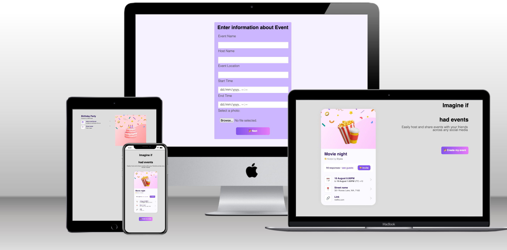

[](https://app.netlify.com/sites/envited-ta-buari/deploys)

# PROJECT: Envited Technical assessment (React & Figma)

> This is a project about building the initial front end for an event social media application that display event using react functional component, State, ES6 modules, import and export, react-router, setting up the environment and tools needed to develop a React application using Create React App (CRA).

## 🌐 [Live link](https://add-envited-assessment--envited-ta-buari.netlify.app/)

## 🖼️ Screenshot



## 🛠️ Development

- Clone the project

```bash
git clone https://github.com/bimbolabuari/envited-ta.git

```

- Install Dependencies

```bash
npm install
```

- Run Eslint

```bash
npx eslint .
```

- Run Stylelint

```bash
npx stylelint "**/*.{css,scss}"
```

- Start server (Development mode)

```bash
npm run start
```

- Start server (Production mode)

```bash
npm run build
```

## 🤝🏾 Contributing

Contributions, issues and feature requests are welcome!

Feel free to check the [issues page](../../issues).

## ⭐️ Show your support

Give a ⭐️ if you like this project!

## 👨🏽‍💻 Author

- [@bimbolabuari](https://github.com/bimbolabuari/)

## 📝 License

[MIT licensed](./LICENSE).
